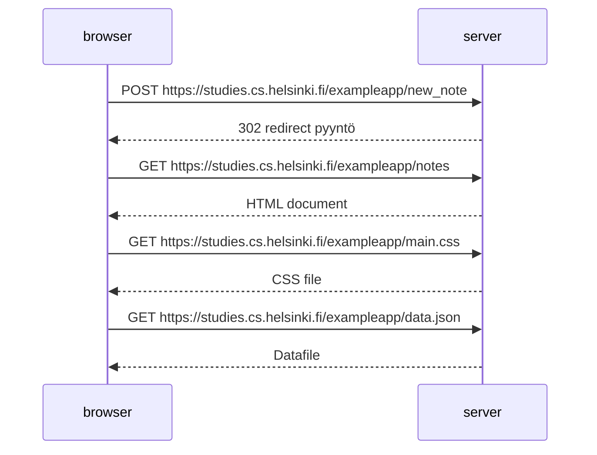

Käyttääjä kirjoittaa tekstikenttään haluamansa muistiinpanon ja painaa save- painiketta niin lähtee seuraavanlainen tapahtumaketju:

```mermaid

sequenceDiagram
    participant browser
    participant server

    browser->>server: POST https://studies.cs.helsinki.fi/exampleapp/new_note
    %% browser sends the created new data (note) to server's address "new_note"

    server-->>browser: 302 redirect pyyntö
    %% server answers with HTTP code 302 (redirect) -> server asks browser to do automatic HTTP GET -request
    browser->>server: GET https://studies.cs.helsinki.fi/exampleapp/notes

    server-->>browser: HTML document

    browser->>server: GET https://studies.cs.helsinki.fi/exampleapp/main.css

    server-->>browser: CSS file

    browser->>server: GET https://studies.cs.helsinki.fi/exampleapp/data.json
    server-->>browser: Datafile 
    
```
