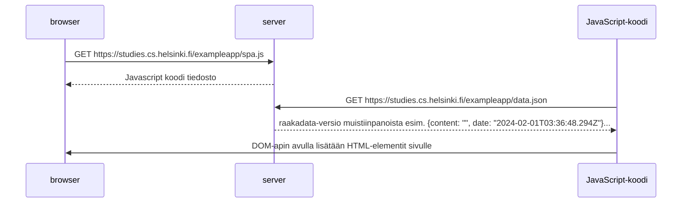

Käyttäjä menee Single Page App- versioon

```mermaid

sequenceDiagram
    participant browser
    participant server
    participant JavaScript-koodi

    browser->>server:  GET https://studies.cs.helsinki.fi/exampleapp/spa.js
    %% Selain pyytää palvelimelta java-script koodia
    server-->>browser: Javascript koodi tiedosto
    
    JavaScript-koodi->>server: GET https://studies.cs.helsinki.fi/exampleapp/data.json
    %% Selaimessa suoritettava koodi hakee palvelimelta raakadata version muistiinpanoista ja lisää sivulle lisäksi tarvittavat HTML-elementit
    server-->> JavaScript-koodi: raakadata-versio muistiinpanoista esim. {content: "", date: "2024-02-01T03:36:48.294Z"}...
    JavaScript-koodi->>browser: DOM-apin avulla lisätään HTML-elementit sivulle
    
```
