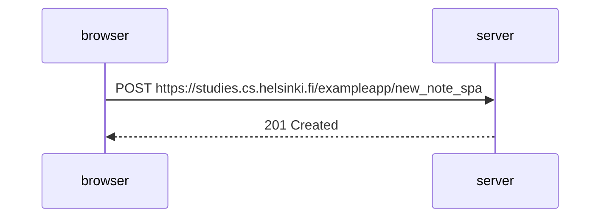

SPA-versiossa luodaan uusi muistiinpano

```mermaid

sequenceDiagram
    participant browser
    participant server

    %% koodi hakee lomake-elementin jolle rekisteröidään tapahtumakäsittelijä hoitamaan lähetyksen
    %% estetään sivun uudelleen lataus lähetyksen yhteydessä, sillä semmoiset eivät kuulu single page appeihin
    %% koodi luo muistiinpanon 

    browser->>server: POST https://studies.cs.helsinki.fi/exampleapp/new_note_spa
    %% koodi lähettää palvelimelle juuri luodun uuden noten osoitteeseen "new_note_spa"

    server-->>browser: 201 Created
    %% palvelin vastaa HTTP 201 created- statuskoodilla
    %% uudelleenohjaukselle ei tarvetta SPA-apissa.
    %% Selain pysyy samalla sivulla, ei tarvetta muille HTTP-pyynnöille

    
 
   
    
```
